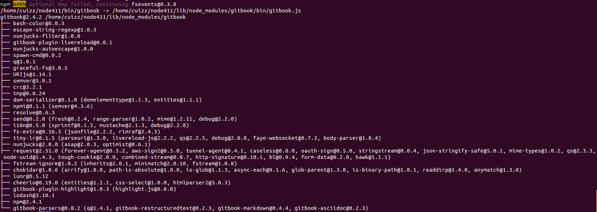

1.  安装node.js
    *   下载node.js

        到[node.js](https://nodejs.org/en)的官方网站下载相应的node.js的程序包。

    *   解压缩程序包

            tar zxvf node-v4.1.1-linux-x64.tar.gz
    
    *   将程序放在特定的目录上，并修改环境变量。最终验证node的版本号：
            node -v

        如果显示下面的信息说明部署正确：
        
            v4.1.1

2.  安装gitbook工具

    *   使用npm工具安装
    
            npm install gitbook -g
            
    *   返回下面的信息说明安装完成：
    
        
    
     需要注意的是默认情况下npm使用的是国外的源，我们可以修改为淘宝的源即可：
     
            npm install -g cnpm --registry=http://registry.npm.taobao.org
    
     也可以直接修改配置文件：
     
            vi /home/cuizz/.npmrc
            
     修改为下面的信息即可：
     
            registry=http://registry.npm.taobao.org
        
    崔中政